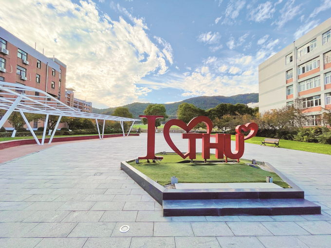
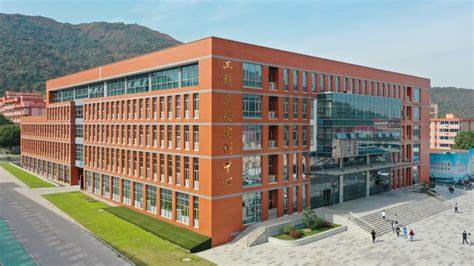



WUXI TAIHU UNIVERSITY
======
It is a full-time, multidisciplinary application-oriented undergraduate university approved by the Ministry of Education.
Wuxi Taihu University is a full-time, multidisciplinary applied undergraduate university approved by the Ministry of Education, located in Wuxi urban area, national forest park, covering an area of 2,000 acres, more than 25,000 teachers and students, known as the "university in the garden", adjacent to Shanghai, convenient transportation, beautiful scenery
  

